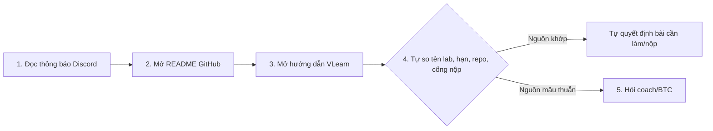
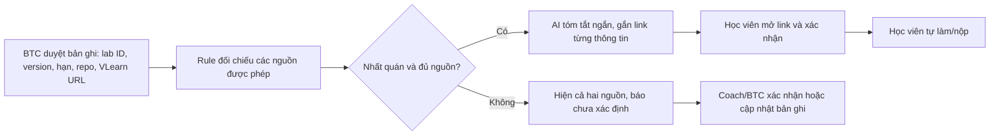
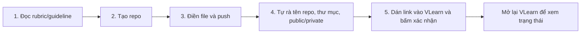
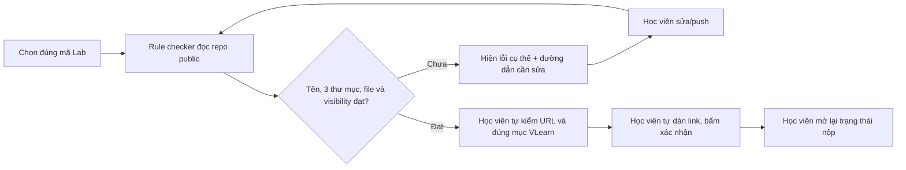
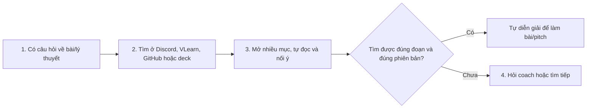
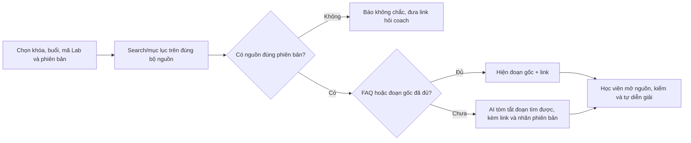

# 3 workflow cho Top 3 Problem Cards — Nguyễn Văn Duy

> Bản sơ đồ để Duy kiểm tra và tự pitch. Đây là **workflow đề xuất**, chưa phải công cụ đã xây hoặc hiệu quả đã đo. Mọi mốc cải thiện bên dưới là mục tiêu pilot; Duy và nhóm cần xác nhận lại các bước thực tế.

## Card #1 — Xác định đúng yêu cầu và hạn nộp (#1 + #5 trong scan)

**Actor:** học viên; coach/BTC là người xác nhận khi nguồn mâu thuẫn. **Đầu ra cần có:** mã lab, bộ đề, hạn, repo và cổng nộp đúng, kèm link nguồn.

**Hiện tại — 5 bước, thời gian chưa đo:**

**Bottleneck:** bước 4–5. Trong phiên có hai mốc hạn Lab 1 và hai bộ tài liệu Day 02; chưa biết nguồn nào có thẩm quyền chốt nếu thông báo chưa được đồng bộ.

**Sau cải thiện — đề xuất, chưa triển khai:**

| Tiêu chí kiểm workflow | Cách kiểm |
|---|---|
| Baseline không AI | Trang nguồn chuẩn có version và người duyệt; rule cảnh báo hai mốc khác nhau. |
| Metric pilot | Bấm giờ xác định đúng yêu cầu trên cùng bộ ít nhất 20 case; mục tiêu giảm ≥50% thời gian và phát hiện 100% xung đột trong bộ case đã gán nhãn. |
| Ranh giới con người | AI không tự chọn hạn chính thức, không đổi thông báo và không tự nộp. Học viên/coach kiểm nguồn gốc. |
| Fallback | Thiếu nguồn hoặc còn mâu thuẫn → dừng kết luận, hiện các link và chuyển coach/BTC. |

## Card #2 — Kiểm tra repo trước khi nộp (#2 trong scan)

**Actor:** học viên nộp bài. **Đầu ra cần có:** repo đúng bài, đủ ba thư mục bắt buộc, public, link repo đã được dán/xác nhận ở đúng mục VLearn.

**Hiện tại — 5 bước và kiểm lại trạng thái, thời gian chưa đo:**

**Bottleneck:** bước 4; dễ bỏ sót file hoặc nhầm repo. Một lần push lên GitHub không chứng minh ô nộp VLearn đã có link.

**Sau cải thiện — đề xuất, chưa triển khai:**

| Tiêu chí kiểm workflow | Cách kiểm |
|---|---|
| Baseline không AI | Checklist hoặc script rule kiểm cấu trúc/visibility; LLM chỉ đáng dùng nếu cần giải thích lỗi khó hiểu. |
| Metric pilot | Trên 20 repo mẫu có lỗi chủ ý: mục tiêu phát hiện 100% thiếu file/thư mục và repo private, 0 cảnh báo sai ở mẫu chuẩn. Đây chưa phải kết quả. |
| Ranh giới con người | Công cụ không dùng tài khoản học viên để tự push hoặc tự nộp; trạng thái VLearn do học viên kiểm trực tiếp. |
| Fallback | Không truy cập được repo hoặc rule chưa hiểu định dạng → mở checklist gốc, rà thủ công. |

## Card #3 — Tìm và hiểu đúng đoạn tài liệu (#3 + #6 trong scan)

**Actor:** học viên cần làm bài, ôn lý thuyết hoặc chuẩn bị giải thích. **Đầu ra cần có:** đoạn tài liệu đúng khóa/buổi, câu trả lời ngắn và link để tự đối chiếu.

**Hiện tại — 4 bước, thời gian chưa đo:**

**Bottleneck:** bước 2–3. Trong phiên đã phải đối chiếu deck 21 slide của bộ cũ, 12 mục VLearn Lab 2 và worksheet GitHub mới; không được trộn chúng thành một phiên bản bài học.

**Sau cải thiện — đề xuất, chưa triển khai:**

| Tiêu chí kiểm workflow | Cách kiểm |
|---|---|
| Baseline không AI | Mục lục/FAQ có phiên bản và tìm kiếm thường; chỉ thêm LLM nếu baseline chưa đủ. |
| Metric pilot | Trên 20 câu hỏi kiểm thử: mục tiêu ≥95% câu trả lời dẫn đúng phiên bản/link và giảm ≥40% thời gian tìm so với FAQ/search. Chưa đo baseline hoặc kết quả. |
| Ranh giới con người | AI không biến slide bộ cũ thành quy định của Lab 2 hiện tại; học viên mở link và tự hiểu trước khi dùng. |
| Fallback | Không tìm được nguồn hoặc hai phiên bản khác nhau → báo chưa chắc, không bịa đáp án, hỏi coach. |

**Câu tự kiểm khi trình bày:** Mỗi card phải nói được *ai đang làm → bước nào nghẽn → có bằng chứng gì → cách không AI nào thử trước → AI chỉ làm bước nào → ai kiểm và fallback ra sao*. Ba sơ đồ này là nháp cá nhân để Duy tự giải thích, chưa phải quyết định của nhóm.
