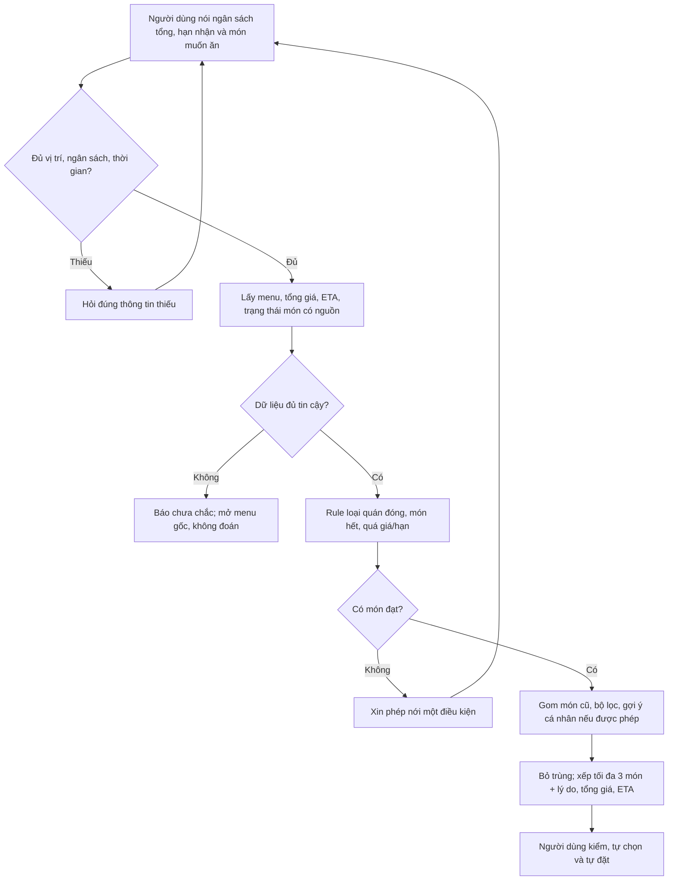

# 02 — Group Problem Statement: chọn món ăn khi bận

> **Bản làm việc, chưa phải bản nhóm chốt để nộp.** Google Doc chung ghi candidate nhóm chọn là “Mất thời gian chọn món ăn”. Doc có bảng interview/survey đã điền, nhưng tab “Thẻ 2” nói rõ phần đó là **kịch bản minh họa cần thay bằng dữ liệu thật**. Vì vậy báo cáo này không dùng các quote hoặc tỷ lệ đó như bằng chứng thực nghiệm.

## Thành viên và candidate nhóm chọn

| Định danh trong repo public | Vai trò ghi ở Google Doc | Việc còn cần xác nhận |
|---|---|---|
| Duy — `2A202602729` | Research | Ghi đúng nguồn và phần research tự thực hiện. |
| Dương | Writer | Xác nhận đoạn/bảng đã viết. |
| Nhật | Workflow | Xác nhận workflow đã sửa. |
| Ngân | Workflow | Xác nhận workflow đã sửa. |
| Thân | Facilitator | Xác nhận phần điều phối/quyết định. |

Anh xác nhận **nhóm thực tế có 5 người**. [Worksheet Lab 2](../01-worksheet.md) mô tả nhóm 3–4 người; cần coach xác nhận cách nộp cho nhóm 5. Bản public chỉ dùng tên ngắn, không đăng họ tên đầy đủ/email của thành viên khác.

**Candidate ghi trong Google Doc:** Người bận học/làm việc đặt đồ ăn ngoài phải duyệt nhiều quán và so tổng giá, thời gian nhận, khẩu vị trước khi chốt một bữa. **Phạm vi pilot đề xuất:** một người, một bữa, ngân sách và thời hạn cụ thể; không tự đặt/thanh toán.

## Phase 3 — Group Convergence

### 3.1. Candidate đã có trong Google Doc

Doc ghi **13 ý** (khung 9–12 trong worksheet dành cho nhóm 3–4 người). Bảng này ghi lại nội dung nguồn; **chưa chứng minh mỗi người đã pitch/challenge trực tiếp**.

| # | Người đưa ra | Candidate | Actor / bước nghẽn sơ bộ |
|---:|---|---|---|
| 1 | Dương | Chọn món ăn | Người đặt đồ ăn so nhiều món, giá và thời gian. |
| 2 | Dương | Tìm điểm sạc xe điện | Người dùng không rõ điểm sạc phù hợp. |
| 3 | Thân | Lỗi LLM API | Lập trình viên xử lý định dạng, 429/500, retry. |
| 4 | Nhật | Tìm tài liệu khóa luận | Sinh viên năm cuối sàng lọc nhiều nguồn. |
| 5 | Nhật | Theo dõi deadline | Người học/đi làm kiểm nhiều lịch, kênh. |
| 6 | Nhật | Gom task sau họp | Người dự họp trích việc/người phụ trách từ ghi chú. |
| 7 | Dương | Mang nhiều thẻ vật lý | Cư dân/học viên quên thẻ cần dùng. |
| 8 | Ngân | Bắt kịp nhóm sau khi vắng họp | Thành viên đọc nhiều đoạn chat mới hiểu quyết định. |
| 9 | Ngân | Phản hồi bài làm chậm | Người chấm và người học chờ nhận xét. |
| 10 | Ngân | Sửa CV theo từng JD | Người ứng tuyển so yêu cầu với kinh nghiệm. |
| 11 | Duy | Tìm đúng tài liệu cho công việc | Người làm dự án mở/lọc nhiều nguồn. |
| 12 | Duy | Chuẩn bị pitch | Người trình bày gom/sắp xếp ý từ nhiều nguồn. |
| 13 | Duy | Kiểm nguồn câu trả lời AI | Người nghiên cứu kiểm câu trả lời có đúng nguồn. |

### 3.2. Gom cụm, shortlist và score

**Cụm biên tập lại để không bỏ ý:** (A) chọn giữa nhiều phương án #1, #4, #10; (B) tìm/ghép thông tin và bàn giao #5, #6, #8, #11–13; (C) dữ liệu/quyền/công cụ #2, #3, #7; (D) phản hồi bài làm #9. Nhóm cần xác nhận đây có đúng cách đã thảo luận không.

| Shortlist ghi trong Doc | Actor | Workflow | Evidence | Impact | Làm trong lab | So R/W/A | Hiểu domain | Tổng ghi trong Doc |
|---|---:|---:|---:|---:|---:|---:|---:|---:|
| #1 Chọn món | 5 | 4 | 3 | 4 | 5 | 5 | 5 | **31** |
| #6 Gom task họp | 4 | 5 | 3 | 4 | 3 | 4 | 4 | **27** |
| #10 Sửa CV | 4 | 3 | 3 | 3 | 3 | 3 | 3 | **22** |

**Lý do chọn #1 ghi trong Doc:** actor/workflow dễ mô tả, có thể thử trên menu mẫu và đo thời gian chốt món. #6 cần transcript họp để thử; #10 có tiêu chí “phù hợp JD” khó chấm hơn. Đây là điểm/lý do **được ghi lại**, không tự nhận có biên bản biểu quyết hoặc disagreement thật. Câu challenge và thay đổi sau khi nhóm thảo luận: **chờ nhóm bổ sung**.

## Phase 4 — Validation và research

### 4.1. Bằng chứng còn thiếu

| Nguồn | Trạng thái sau khi đọc cả Google Doc | Cần làm trước khi nộp |
|---|---|---|
| Interview | Bảng ghi 3 người/quote, nhưng tab “Thẻ 2” ghi đó là kịch bản minh họa; hai tab còn có quote khác nhau. **Chưa thể xác nhận là dữ liệu thật.** | Hỏi thật 2–3 người, lưu ghi chú ẩn danh và cả ý kiến phản bác. |
| Survey/poll | Bảng ghi 8 người, tab “Thẻ 2” cũng gọi là ví dụ. **Không dùng tỷ lệ 5/8 hoặc 6/8 như kết quả thật.** | Nếu chọn survey thay interview: thu 5–10 phản hồi thật, lưu link/tổng hợp. |
| Review/log | Doc ghi “10 review” nhưng không có link và cách chọn mẫu. | Chỉ thêm khi có link từng nguồn và ghi rõ mẫu. |

**Câu hỏi để kiểm pain không dẫn dắt:** “Lần gần nhất bạn chọn món mất bao lâu? Bạn mở mấy món/quán? Bạn so tiêu chí nào? Bạn có thường đặt lại món cũ để khỏi chọn không? Gợi ý có giúp bạn chốt nhanh hơn không?” Ghi cả người **không gặp** vấn đề. Chưa có baseline đáng tin để nói 10 phút/lần hay 3–4 lần/tuần là kết quả của nhóm.

### 4.2. Giải pháp đã có (nguồn chính thức)

| Tool / pattern | Họ giải quyết phần nào? | Bài học cho nhóm |
|---|---|---|
| [GrabFood — gợi ý cá nhân và đặt lại](https://www.grab.com/inside-grab/stories/personalising-food-recommendations-on-grabfood/) | Gợi ý theo hành vi và shortcut món quen. | Đây là baseline sản phẩm thật. Con số duyệt món Grab dẫn từ báo cáo khu vực **không phải số của nhóm**. |
| [Grab AI Assistant](https://www.grab.com/inside-grab/stories/grabx-ai-assistant/) | Hiểu yêu cầu bằng lời tự nhiên và giải thích vì sao quán phù hợp. | Không được nói “chưa ai làm gợi ý có giải thích”. |
| [Uber Eats — gợi ý cá nhân hóa](https://www.uber.com/au/en/blog/next-gen-restaurant-recommendation/) | Xếp hạng lựa chọn bằng nhiều tín hiệu ngữ cảnh. | Cá nhân hóa không phải điểm mới; phải thử việc **rút xuống ba món đạt điều kiện cứng** có tiết kiệm thời gian không. |

**Research takeaway:** Nhiều phần của bài toán đã có sản phẩm giải. Giả thuyết hẹp đáng kiểm chứng là: với người đang vội, ba món đều đạt ngân sách/hạn và có lý do rõ giúp chốt nhanh hơn bộ lọc, gợi ý dài hoặc đặt lại món cũ. Chưa có kết quả chứng minh ưu thế này.

## Phase 5 — Workflow và Problem Statement

### 5.1. Current workflow (bản để nhóm bấm giờ)

```text
Đói/bận → mở app/menu → duyệt nhiều quán → đọc review, tổng giá, ETA
→ so qua lại nhiều lựa chọn [bottleneck giả thuyết] → chốt món → tự đặt
```

| Bước | Actor | Input → output | Thời gian |
|---:|---|---|---|
| 1 | Người dùng | Nhu cầu ăn → mở menu. | Chưa đo. |
| 2 | Người dùng | Danh sách quán → xem món. | Chưa đo. |
| 3 | Người dùng | Menu/review → so giá tổng, ETA, sở thích. | **Bottleneck cần xác nhận.** |
| 4 | Người dùng | Các lựa chọn → quay lại so hoặc hỏi thêm. | Chưa đếm vòng lặp. |
| 5 | Người dùng | Một món → tự đặt/mua. | Chưa đo. |

Google Doc ước lượng 10 phút/lần, 3–4 lần/tuần, nhưng chính Doc ghi cần validate. Bản cuối chỉ điền số sau khi nhóm có log thật.

### 5.2. Future workflow (đề xuất từ cuộc trao đổi và Google Doc)



| Metric | Baseline | Mục tiêu pilot đề xuất | Cách đo |
|---|---|---|---|
| Thời gian từ bắt đầu tìm đến **chốt món** | `T0` chưa đo | `T1 ≤ 0,7 × T0` (≥30% giảm), cần nhóm xác nhận | So cùng người/menu: cách hiện tại, Rule+món cũ, top 3. |
| Món top 3 đạt ngân sách/hạn | Chưa đo | Không hiện món vi phạm điều kiện cứng | Kiểm tổng giá/ETA theo menu nguồn từng ca. |
| Hài lòng với món đã chốt | Chưa đo | Không thấp hơn baseline | Thang 1–5 sau khi chốt; hỏi sau bữa nếu làm được. |
| Fallback/bỏ qua gợi ý | Chưa đo | Theo dõi, chưa đặt ngưỡng kết luận | Đếm ca không có dữ liệu/món và ca quay về duyệt thủ công. |

### 5.3. Problem Statement v0 → v1

| Field | v0 ghi trong Doc | v1 đề xuất để nhóm xác nhận |
|---|---|---|
| Actor | Người thường đặt đồ ăn ngoài. | Người bận học/làm việc đặt **một bữa**, có ngân sách và hạn nhận cụ thể. |
| Workflow | Duyệt quán, menu, review, giá, ETA rồi đặt. | Tách rõ bước **so/chốt món** trước thao tác đặt. |
| Bottleneck | Quá nhiều lựa chọn. | Phải tự so nhiều món trên nhiều tiêu chí mà chưa có shortlist ngắn đáng tin. |
| Impact | Doc ước lượng 10 phút/lần, 3–4 lần/tuần. | `T0` và tần suất chưa đo; rủi ro tốn thời gian/chọn món không ưng ý cần kiểm chứng. |
| Success Metric | Doc đặt mục tiêu 10 → 5 phút. | Thử mục tiêu ≥30% giảm thời gian trên cùng menu **không giảm hài lòng**. |
| Boundary | Người dùng tự quyết định/thanh toán. | Chỉ gợi ý tối đa 3 món có nguồn giá/ETA; không tự đặt, tự đổi điều kiện hoặc đoán dữ liệu. |

**AI intervention point:** nếu cần, AI chuyển câu tự do thành tiêu chí và giải thích top 3; Rule kiểm giá/ETA/trạng thái. Nếu Rule + món quen đã giảm pain đủ, không cần thêm LLM.

## Phase 6 — Rule / Workflow / Agent và quyết định

| Mức | Cách áp dụng | Điều cần chứng minh |
|---|---|---|
| No AI / process fix | Món quen, bộ lọc giá/thời gian, shortcut đặt lại. | Baseline bắt buộc. |
| Rule | Lọc tổng giá, quán mở, món còn, ETA; xếp theo giá/thời gian. | Có giải được phần lớn ca không? |
| Workflow | Input → Rule lọc → tùy chọn AI hiểu câu tự do/xếp giải thích → người dùng kiểm/đặt. | **Mức Doc đề xuất**, nhánh cố định và có fallback. |
| Agent | Tự tìm thêm nguồn, đổi tiêu chí, đặt món thay người dùng. | Chưa có bằng chứng cần; tăng rủi ro chi tiêu/dữ liệu. |

**Mức đề xuất:** Rule-first Workflow; AI là bước tùy chọn phải chứng minh lợi ích so với baseline. **Decision Google Doc ghi: `Not Yet`**. Lý do: baseline chưa đo, interview/survey trong Doc được mô tả là ví dụ, menu cập nhật cho pilot chưa có. Không gọi đây là sản phẩm đã triển khai.

**Pilot nhỏ nhất nếu đủ điều kiện:** menu mẫu khoảng 20–30 món có tổng giá/ETA, nguồn và thời điểm chụp; thử ba cách trên cùng menu. Đo thời gian chốt, tỷ lệ đạt điều kiện, hài lòng và fallback. Menu mẫu không chứng minh quán còn món/ETA thật ngoài đời; thiếu dữ liệu thì báo chưa chắc.

## Cần bổ sung trước khi nộp bản nhóm

- [ ] Coach xác nhận cách nộp cho nhóm **5 người**.
- [ ] Nhóm xác nhận 13 candidate, score, lý do chọn và ghi lại pitch/challenge/disagreement thật. Doc hiện chỉ ghi **1 candidate của Thân**; worksheet yêu cầu mỗi người trình bày top 3, nên cần bổ sung hoặc giải thích với coach.
- [ ] Có **2–3 interview thật hoặc 5–10 survey thật**, kèm notes/link và phản hồi trái chiều; loại toàn bộ quote minh họa.
- [ ] Có baseline bấm giờ và menu mẫu có nguồn/thời điểm; chốt metric sau khi nhìn dữ liệu.
- [ ] Nhóm duyệt v1, vai trò/đóng góp từng người và copy **cùng bản cuối** vào repo cá nhân.
